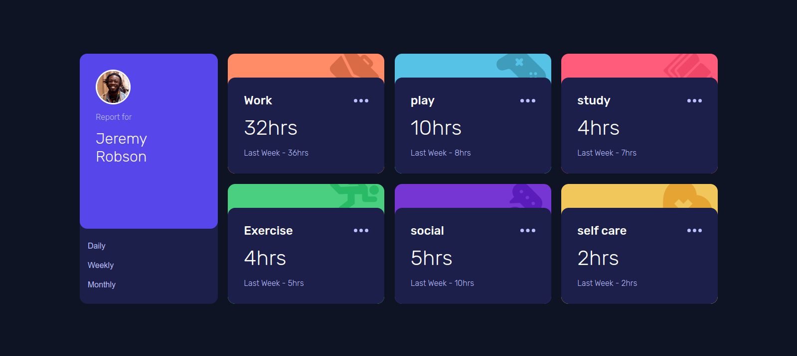
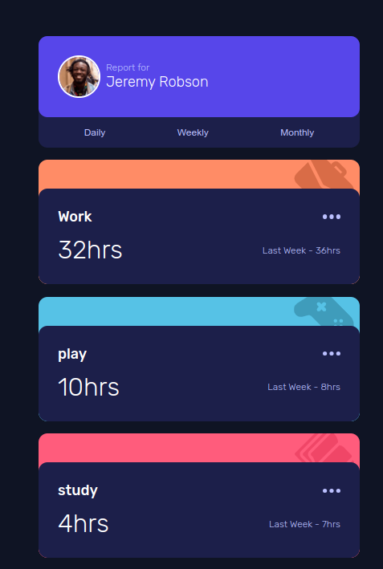

# Frontend Mentor - Time tracking dashboard solution

This is a solution to the
[Time tracking dashboard challenge on Frontend Mentor](https://www.frontendmentor.io/challenges/time-tracking-dashboard-UIQ7167Jw).
For all my exercise check [Front End Mentor Exercises]()

## Table of contents

- [Overview](#overview)
  - [The challenge](#the-challenge)
  - [Screenshot](#screenshot)
  - [Links](#links)
- [My process](#my-process)
  - [Built with](#built-with)
  - [What I learned](#what-i-learned)

## Overview

### The challenge

Users should be able to:

- ✅ View the optimal layout for the site depending on their device's screen
  size
- ✅See hover states for all interactive elements on the page
- ✅Switch between viewing Daily, Weekly, and Monthly stats

### Screenshot

 

### Links

- Solution URL: https://github.com/ahmad-kashkoush/time-tracking-dashboard
- Live Site URL: https://time-tracking-dashboard-five-rust.vercel.app/

## My process

### Built with

- Semantic HTML5 markup
- sass
- Flexbox
- CSS Grid
- Mobile-first workflow
- Javascript

### What I learned

- Don't nest too much while working with sass
